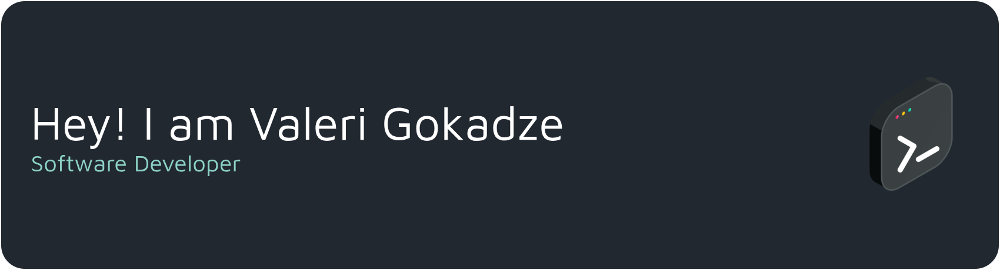

  

---

	 

## 🔗 Connect with me:

[![WebPage](https://img.shields.io/badge/WebPage-7cebf5?&style=for-the-badge&logo=data:image/png;base64,iVBORw0KGgoAAAANSUhEUgAAAQAAAAEABAMAAACuXLVVAAAAD1BMVEUAAAAAAAAAAAAAAAAAAABPDueNAAAABHRSTlMAP3+/b90PEwAABzlJREFUeNrtnW2WsywMhgFdgGfqAhjqApw+LqBV97+m90dby0cSUOvc855T/s1I4SIJUb6CUhuTc928pNE59ZtJu5lIrvml6r+GmUnT9y9U72YxHa2KrzmbjpSCGeaCNNmj6j/PhekCbP5xQviaV6VvmPgPUkM3r07jOz0fU//dG4+Maxjf5hk1bX5TcxfMKGQ4uP4nwLEEUuFPgEMJgqKnpTc0ygdQerH+MP+b7f+y/NmrEEBVi/Gf39oX2tC/PRt6UzHAkrMJfeZtX/2nqDGtr4AQwGfzxfazy//HBUXN8gEWuBjcvqcDWE/Ri3EHAM/cfYS+oyt0cTP8KhKABS8W3vgGA7C+midFAzz5mpjgZ7cB2EDLPQdQBRZi9prBkPx+eFkZCaBCCZl9/qhN6jdJz44BWvIH27yBSTXYBj6AAtBRdacdShhS+CERZwyQZGk3K+GU9iETmyABUMXt7Tb2BE14kTY2QQJAxVJ7+bJmmwXaWLw3GaCNBW422aEhBKdTDRAAVdLc0xY7HAjTqVMNEAAPHVwzhWVSRemtIwRJALSJ+1/sqV8tgJ+0aTYHYFJBndaKoKJ+YKgyCIAHvaUa1K8UQNBxasqUKYA2MYJFCdM6AdwIqj4PUBF1tatEMFAfMpr0JhQAlfPpjqY1Auiz7aIBSFlVK0RAw9apZjkAMmu5CBjWjnRmJICZWcsoEQGDSrhBDoDOWyoCQ7+7DP152/H/jaWlC98ILf3qok2AAaAzt0UvRc28vGkTYABocemi7wIOcyBNgAFQtLaLRDDQtqqZEU4n/DtpalVghhXzAVcx7AxAS7biVNATuU/ImvklA1BRVngqGCpqbp6xY8yHAaA05s2b8GZYc3MrA6M8BoDI709ZXMvmo7x5Rs4GWYBYYuFM51QyHxK8jw0HzgHUoduIJ9ptwYRUMOVdcz/jAELiZKL9VqIBXw0tZzscgPbqISaaJ1ED/1IhMH6QB/B8YajXf5IOnqPvUzjv3zyKG9cAdA9kHa4z/GhJB8vYL7KFC2uDPMDDas7JEkLL68AbfZPLI/0agIpbRKl4HfhsJ+Lndg2AIQr44cbY1OibWKJq1gBodhmL1YHm5pdeGvwuBfjqeAEarjl1REYuQVxcHsCd5YXEgTHpdPRNr9RNzvIAxg3ZNbx2Fj6jQksz/KKgc/GKiXP80qLNjN+9flO2XLdyAbGhmtqTnTDpHV/76/9WRVUNnLM576vecU5qyo+p5WW7slX0hvcRDUFFfy7uEYDw6dvn5lWOA6jZCRjLv6R6t0oTk6tyJU6EWoTvFKuUccWWZ72fsTJt8qNvzzzuuXVeDtNjP5MWRkHpULcWTKCOhBPs4Ypcjr+jK1vkNT/69uwz1osLOC7OOUvJ+SZodcxOwGTe+TuexfVJJnDvIFsBJlVkBJU0ZJOeSQC1INV4tN1KA6YjAExkIF02r10PYLKtGjNzOkcChGMtI40YjTSnIAFoCSBUumiDkipFAJUvtc+Nvo8DCEd7kg3ehTVtARikqYDACofNdWx/GNQ5H1NH/uGcmQHKalKuQ7Qe3+4qcf7yIAC/UrETKJFOBKgkAF/srZRRdCcygOjC/M8F6b0pO9QSAKuyb/l5eyndzp/OeTOT5SgCyNp7majcC0VLkgFk+32ZvikE3QhwzSqoFoV8GIBenspV1OL8ugwwiIsDC4D4urs/HbcBdOIi2RBsv9xTxd6nAxJgypnKPdt1WxV1/un8BwBkf5Wx5AKAzApVk/FDJfLJC1n0RHAAOdeBAM+iS3LZbQDmfwQwIgAePbykjF0AuR9/AGRfK38SZgAyTrYuB1DbAFQRwIwFmD8A8sf7oQCVB2ARAMYDuDgm3dfMuKf31YOJfVxS9q4VoXekD8AH4APwAfgjAHBXDH8ZwV/Hny8iJAD8s/xvDEw+Y0MkAHyC4jNHBJ+m+8yUwierP+sF+CUb+KIVfNkOvnAJX7qFL17Dl+/hGxjwWzjgm1jg23jgG5ngW7ngm9ng2/nwGxrhWzrhm1rh23rhG5vhW7vxm9vh2/vhBxzgRzzgh1y2HfM5BweM9h3zgR90gh/1gh92gx/3wx94hB/5hB965Y/9unlXunDdaiLdDfDgM/zoN/zwO/74fx2ZxpsDIDSRuV+5zmF58R8cAgIeBAMfBgQeCOXFFmnwfaFgbmIoGHwwHDIckCXGMQUAr3aG5iyGA4IHRMKHhIqDYlm6vAKAiFgXBsWChwXDB0aDh4aDB8fDhweEB0jEh4iEB8mEhwnFB0qFh4rFB8uFhwvGB0yGh4zGB82Ghw3HB06Hh47HB8+HXx+Av0ABfoUE/hIN+DUi+ItU8FfJwC/TwV8nhL9QCX6lFP5SLfy1YvCL1fBXy+Ev18NfL4i/YBF/xST8kk38NaP4i1YV/KpZhb9sF3/dMP7CZQW/clrhL91W8GvHlYJfvK4U/Op5pZTSpBhco34zBTu6gj1c69J/MgZkA6JfjHEAAAAASUVORK5CYII=&logoColor=black)](https://gokadzev.github.io/) 
  

 

## 🛠️ Languages and Tools:
 

    
**I also use:**

 

## 📊 Github Stats (Expand to View)

 
  
<b>💻 GitHub Profile Stats</b>

   
  

    
	

   
  

  
<b>⚡ Recent GitHub Activity</b>

   
   
   

 

---

