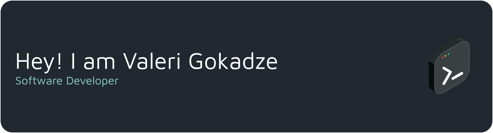

  

---

 &nbsp;  &nbsp; 

## 🔗 Connect with me:

[![WebPage](https://img.shields.io/badge/Website-7cebf5?color=2DD4B9&style=for-the-badge&logo=&labelColor=555)](https://gokadzev.github.io/) 

 

## 🛠️ Languages and Tools:

 

 

## 📊 Github Stats (Expand to View)

<!-- 

  
<b>💻 GitHub Profile Stats</b>

   
    
   

 -->

  
<b>🔥 GitHub Streak</b>

   
   
   

  
<b>⚡ Recent GitHub Activity</b>

   
   
   

 

---
